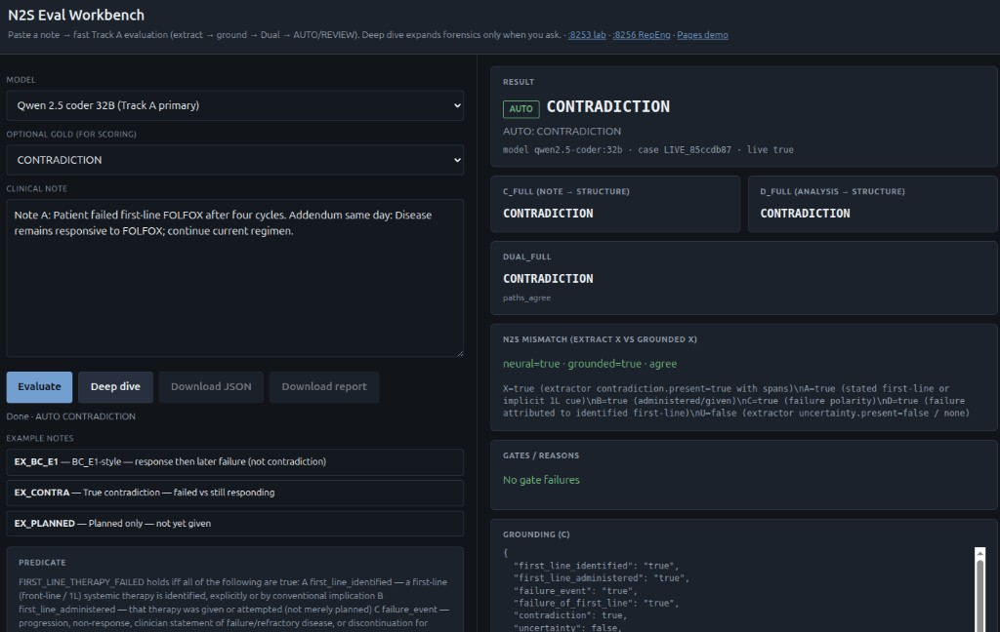
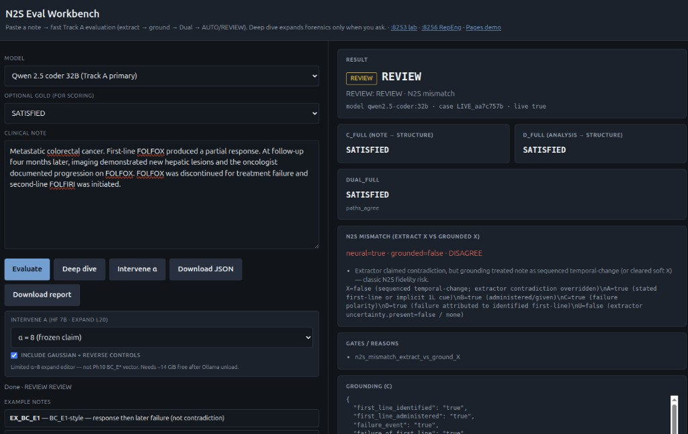
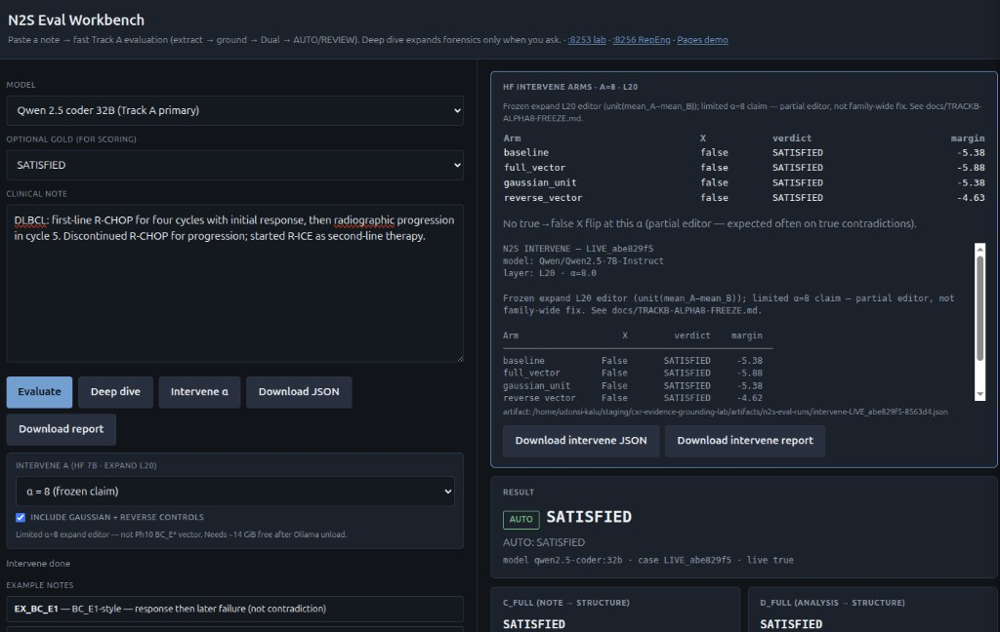
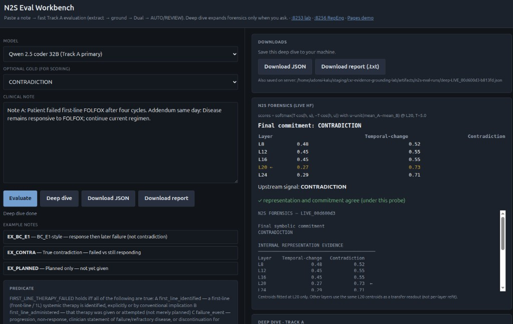
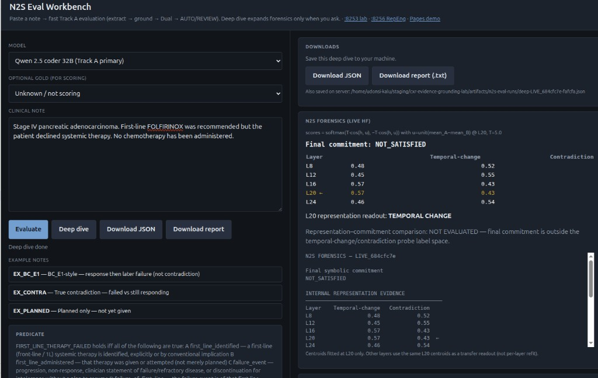
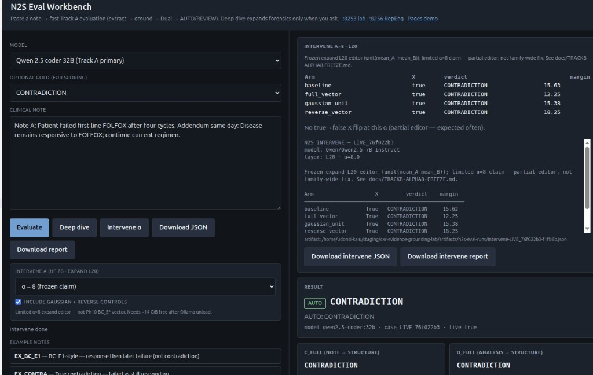
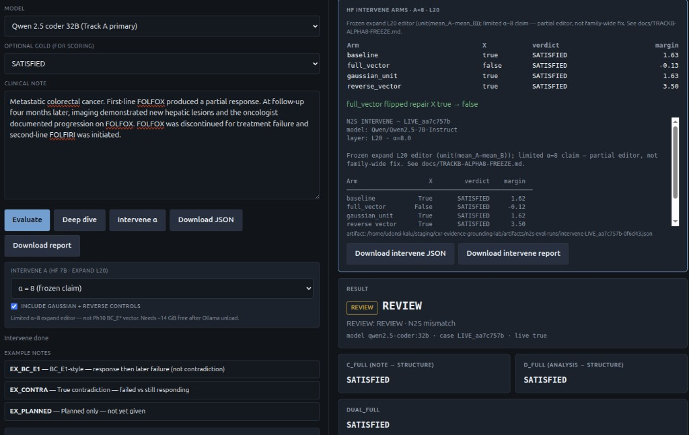

\newpage

# Who this is for

This guide explains **what we built and ran** in the N2S Eval Workbench, in plain language.

You do **not** need to already know mechanistic interpretability (MI) or Representation Engineering (RepEng). Those ideas are introduced briefly below, then tied to the **four** workbench actions:

**Evaluate → Deep dive → Intervene α → SAE features**

**One sentence version of the project:**  
We paste a doctor's note, ask a model whether "first-line therapy failed," then optionally look *inside* the model, nudge a frozen direction, and (when needed) decompose that direction into sparse features — while Track A keeps AUTO vs REVIEW auditable.

**Scope of this tour:** the **downstream** path (utilization / generation) plus the **neural→symbolic boundary** (Track A Dual / gates).  

**Upstream** (formation map, U-A/U-B, live Score on **:8258**) has its own complete write-up:  
`docs/N2S-Upstream-Workbench-Tour.md` / `.pdf` — including a full decode of `d = unit(μ_T − μ_C)`.

**One-page claim freeze:** lab `docs/N2S-SYSTEM-CLAIM.md` · closeout `TRACKB-DOWNSTREAM-CLOSEOUT.md` · upstream portfolio `TRACKB-UPSTREAM-PORTFOLIO.md` · Track A `TRACKA-TEMPORAL-FAMILY-FREEZE.md` · circuit `TRACKB-CIRCUIT-C01-FREEZE.md`.

## System characterization (three pieces)

```text
Doctor's note
      ↓  UPSTREAM — formation / evolution of representations (:8258 + lab)
Tokenization → layer-wise compute → internal reps
      ↓  DOWNSTREAM — utilization → structured LLM output (this tour · :8257)
Generation / commit (e.g. contradiction.present)
════════════════════════════
   NEURAL → SYMBOLIC BOUNDARY  (hard cut · Track A)
════════════════════════════
CXR atoms / Dual / gates → AUTO | REVIEW
```

Upstream vs downstream is an **experimental partition** (formation → utilization), not a hard layer line inside the transformer. The only hard cut is neural → symbolic.

\newpage

# Background theory (gentle)

## Neural-to-symbolic (N2S)

Large language models are good at reading messy clinical text. Rules engines are good at **auditable** decisions. N2S means:

1. **Neural** — the model extracts structured claims (therapy, given?, failure?, conflict?).  
2. **Symbolic** — deterministic code turns those claims into atoms and fires a rule.  
3. **Gates** — if extractors disagree, or claims cannot be evidenced, we **REVIEW** instead of silently AUTOing a wrong answer.

So Track A is mostly **reliability engineering**, not "interpretability theater."

## What is MI?

**Mechanistic interpretability** asks: *what internal computations* produce a behavior?

In our workbench we take **small, causal steps** into MI on HF **Qwen 2.5 7B**:

- Read **activations** (hidden vectors) at selected **layers** (Deep dive).  
- Ask whether **L20** looks more like a **temporal-change** or **contradiction** pattern.  
- **Steer** L20 with a frozen direction **v** (Intervene α).  
- **Decompose** **v** with a published L20 **SAE** and steer top-k features (SAE features).  
- **Circuit ladder (lab CLI):** who writes along **v** at commit (C0) → patch L20 MLP (C1) → path restrict (C2). Soft gates frozen — see Phase 5.

**Stack:** Hugging Face `transformers` + PyTorch **forward hooks** (callbacks on a layer’s output). We do **not** rewrite the model into TransformerLens for this workbench.

## What is RepEng?

**Representation Engineering** (Zou et al.–style idea, applied narrowly here) says:

> If a concept lives as a direction in activation space, you can **read** it (probe) and sometimes **write** it (steer).

Our write step is simple:

**h ← h + alpha · v**

### Glossary — how to read `v = unit(μ_A − μ_B)`

| Symbol | Plain English |
|--------|----------------|
| **Class A** | Gold SATISFIED temporal-change notes where HF already said X=false (expand fit) |
| **Class B** | Gold CONTRADICTION notes where HF said X=true |
| **μ_A / μ_B** | Mean **commit-token** residual at L20 over those classes |
| **μ_A − μ_B** | Difference pointing toward “more A / less B” geometry |
| **unit(·)** | Normalize to length 1 — direction only |
| **v** | Frozen expand direction used by Intervene / SAE / circuit |
| **α (alpha)** | How hard we push; frozen claim uses **α = 8** |
| **h** | Hidden state at L20 on the `contradiction.present` commit token |

So **v** points roughly from “true contradiction geometry” toward “temporal / non-contradiction geometry.” Pushing along **v** can clear some **false X** without being a magic family-wide fix.

**Do not confuse with Upstream `d = unit(μ_T − μ_C)`** (prefill note means @ L24). cos(d, v) ≈ 0.03 — almost orthogonal. Full Upstream decode: `N2S-Upstream-Workbench-Tour.pdf`.

## Why controls matter

Any steer can look impressive until you check:

| Control | What it rules out |
|---------|-------------------|
| **baseline** | "Did X already flip without us?" |
| **gaussian_unit** | "Would *any* random push of size alpha work?" |
| **reverse_vector (−v)** | "Is the sign of v meaningful?" |

A credible story: **full_vector** flips false X; gaussian does not; reverse does not help; true contradictions stay X=true.

## Two clinical traps (memorize these)

1. **True contradiction** — same visit says "failed" *and* "still responding." → gold **CONTRADICTION**.  
2. **Temporal change** — responded *earlier*, progressed *later*. → gold often **SATISFIED** (therapy failed), **not** contradiction. Models sometimes wrongly set **X=true** (false contradiction).

Track A contains false-X via grounding + Dual + REVIEW. Track B asks whether L20 geometry *causes* some of that false X.

\newpage

# The clinical question (Track A)

We care about one formal question (a **predicate**):

> Did **first-line therapy fail**?

In code: `FIRST_LINE_THERAPY_FAILED`. Roughly:

| Atom | Meaning |
|------|---------|
| **A** | A first-line therapy is identified |
| **B** | It was actually given (not only planned / declined) |
| **C** | A failure / progression event happened |
| **D** | That failure is of that first-line |
| **X** | Same-time incompatible claims → short-circuit **CONTRADICTION** |

Rule sketch: if X → CONTRADICTION; else if A∧B∧C∧D → SATISFIED; else NOT_SATISFIED / UNCERTAIN.

**REVIEW** means a human should look — Dual paths disagreed, evidence gate failed, verify failed, or neural X ≠ grounded X (**N2S mismatch**).

\newpage

# The workbench in four buttons

Run at `http://127.0.0.1:8257/` (prefer `../cxrlabs/faiss_gpu1/bin/python server.py` for HF GPU phases).

| Button | What it does | Model used | Enabled when |
|--------|----------------|------------|----------------|
| **Evaluate** | Fast Track A: extract → ground → Dual → AUTO / REVIEW | Ollama (e.g. Qwen 32B) | Always (with a note) |
| **Deep dive** | Round-trip + L20 readout (forensics) | HF Qwen 7B | After Evaluate |
| **Intervene α** | Steer L20 with **v**; baseline + full_vector (+ optional gaussian / reverse) | HF Qwen 7B | Note pasted (Evaluate optional) |
| **SAE features** | Rank Chanin L20 sparse features vs **v**; steer top-k (± / random / group) | HF Qwen 7B + SAE weights | Note pasted (Evaluate optional) |

**Rule of thumb:** Evaluate first for Track A. Deep dive to *observe* L20. Intervene for a one-direction *causal* nudge. SAE when you need a *sparser* decomposition of the same **v**.

**UI hygiene (shipped):** hard-refresh restores the last Evaluate / Deep dive / Intervene / SAE panel from **sessionStorage** in this browser tab (note + results). Intervene and SAE stay available whenever a note is present (they do not require Deep dive).

Built-in UI pastes: **EX_BC_E1**, **EX_CONTRA**, **EX_PLANNED**. Harder DEV fixtures (TX_E14, TF_E5, …) live in the lab `data/` JSON files.

\newpage

# Functions at play (map)

Think of three layers: **UI API → Track A library → Track B library**.

## Workbench API (`cxr-n2s-eval-workbench/`)

| Function | Role |
|----------|------|
| `evaluate_fast` | One-shot Track A Evaluate |
| `submit_deep_dive` / `_deep_dive_work` | Async Deep dive job |
| `submit_intervene` | Async Intervene job → lab `run_intervene_live` |
| `submit_sae` | Async SAE job → lab `run_workbench_sae` |
| `job_status` / `meta_payload` | Poll progress; ship example notes to UI |
| `_verified_pipeline` | extract → ground → verify → rule (per Dual path) |
| `_mismatch` | neural X vs grounded X → REVIEW signal |

HTTP routes (port **8257**): `POST /api/evaluate`, `/api/deep-dive`, `/api/intervene`, `/api/sae`; `GET /api/job`, `/api/meta`.

## Track A lab (`cxr-evidence-grounding-lab/n2s_lab/`)

| Function | Module | Plain role |
|----------|--------|------------|
| `analyze_free_text` | `neural.py` | Short free-text read of the note (feeds path D) |
| `extract_live` | `neural.py` | Note → structured Extraction (path C) |
| `extract_from_analysis` | `neural.py` | Analysis text → Extraction (path D) |
| `extract_*_repair` | `neural.py` | One repair pass after verify fail |
| `paraphrase_from_extraction` | `neural.py` | Structure → paraphrase (round-trip) |
| `ground` | `ground.py` | Extraction → atoms A–D / X; clears false X on sequenced temporal change |
| `verify_formalization` | `verify.py` | Did structure keep important distinctions? |
| `evaluate_rule` | `predicate.py` | Atoms → SATISFIED / NOT_SATISFIED / CONTRADICTION / … |
| `dual_path_verdict` | `roundtrip.py` | C and D agree → AUTO candidate; else REVIEW |
| `verify_roundtrip` | `roundtrip.py` | Paraphrase must preserve conflict / uncertainty |
| `gate_verdict_with_evidence` | `evidence.py` | Claims must be spannable in the note |
| `apply_gates` / `classify_case` | `auto_contract.py` | Final AUTO vs REVIEW; wrong_AUTO buckets |

**Evaluate wiring order:** analyze → path C & D pipelines → evidence gate → Dual → N2S mismatch → gates → AUTO/REVIEW.

## Track B lab (same package)

| Function | Module | Plain role |
|----------|--------|------------|
| `build_directions_from_expand` | `n2s_forensics.py` | Build L20 `unit(mean_A − mean_B)` artifact |
| `load_directions` | `n2s_forensics.py` | Load frozen directions JSON |
| `score_layer_hiddens` | `n2s_forensics.py` | Soft scores temporal vs contradiction @ layers 8–24 |
| `run_forensics_live` | `n2s_forensics.py` | HF 7B forward + L20 readout |
| `format_forensics_text` | `n2s_forensics.py` | Human-readable forensics panel |
| `load_expand_direction` | `n2s_intervene.py` | Load expand **v** (not old Phase-10 BC_E* vector) |
| `run_intervene_live` | `n2s_intervene.py` | Four arms @ alpha (default 8) |
| `format_intervene_text` | `n2s_intervene.py` | Human-readable intervene panel |
| `run_workbench_sae` / pilot CLI | `n2s_sae_pilot.py` | Load Chanin L20 SAE; rank feats vs **v**; top-k steers |

Direction artifact: `artifacts/n2s-forensics-directions-qwen7b.json`.  
SAE pilot docs: lab `docs/TRACKB-SAE-PILOT.md`.  
Frozen claim write-up: lab `docs/TRACKB-ALPHA8-FREEZE.md`.

\newpage

# Phase 1 — Evaluate

## What Evaluate is

Paste a note → two formalization paths:

- **C** — note → structure  
- **D** — free-text analysis → structure  

If they **agree**, Dual can **AUTO**.  
If they **disagree**, Dual stays **REVIEW**. That disagreement is a *feature*: we do not force every note to AUTO with one-off patches.

**N2S mismatch:** extractor claims contradiction (**neural X**) while grounding cleared it (**grounded X**) → **REVIEW**.

## Example A — true contradiction → AUTO CONTRADICTION

**Workbench id:** `EX_CONTRA`

> Note A: Patient failed first-line FOLFOX after four cycles. Addendum same day: Disease remains responsive to FOLFOX; continue current regimen.

**Wanted:** CONTRADICTION.  
**Evaluate:** C = D = Dual = CONTRADICTION; neural X and grounded X agree → **AUTO**.



## Example B — temporal failure with extract/ground fight → REVIEW

**Live paste** (response, then later progression):

> Metastatic colorectal cancer. First-line FOLFOX produced a partial response. At follow-up four months later, imaging demonstrated new hepatic lesions… FOLFOX was discontinued for treatment failure…

**Wanted clinically:** SATISFIED (failure after prior response), **not** contradiction.  
**Evaluate:** Dual may say SATISFIED, but extractor often sets X=true while grounding clears X as temporal-change → **N2S mismatch** → **REVIEW**.



This is the note that later becomes the Intervene "selective flip" demo.

## Example C — clean temporal note already clean → AUTO SATISFIED

**Workbench id:** `EX_BC_E1` (pembrolizumab + chemo, response → later progression).

Paths and X already agree → **AUTO SATISFIED**. Nothing broken; Evaluate is done. Soft cases like this are **poor** Intervene tests (baseline X often already false on 7B).



## Example D — planned only → NOT_SATISFIED

**Workbench id:** `EX_PLANNED`

> Newly diagnosed metastatic colon cancer. Multidisciplinary plan is to start first-line FOLFOX next week. No systemic therapy has been administered yet.

**Wanted:** NOT_SATISFIED (atom **B** false — therapy not given).  
**Evaluate:** typically AUTO **NOT_SATISFIED** when Dual agrees. Deep dive comparison is **NOT EVALUATED** (commitment outside temporal-vs-contradiction probe space).

## Example E — lab fixtures worth knowing

| Id | Short story | Gold intent |
|----|-------------|-------------|
| **BC_E1** | R-CHOP response → later progression | SATISFIED (temporal) |
| **TF_E5** | FOLFOX stable @ c3 → mets @ c6 | SATISFIED (temporal) |
| **TF_C1** | "never chemo" vs same-day "completed R-CHOP" | CONTRADICTION |
| **TX_E14** | BEP markers clear early → later node / AFP rise | SATISFIED; harder expand case |
| **TX_E01** | gem/nab response → later peritoneal implants | SATISFIED |

**TX_E14 / TX_E01** are better alpha stress-tests than soft BC_E1-style notes when you want baseline X=true on 7B.

## Evaluate summary

| Situation | Typical Evaluate result |
|-----------|-------------------------|
| Same-day fail vs respond | AUTO CONTRADICTION |
| Temporal fail, extractor over-claims X | REVIEW (containment) |
| Clean temporal | AUTO SATISFIED |
| Planned / declined / never given | AUTO NOT_SATISFIED |

\newpage

# Phase 2 — Deep dive

## What Deep dive is

After Evaluate, **Deep dive** adds:

1. **Round-trip** — paraphrase from structure; distinctions must survive (`verify_roundtrip`).  
2. **N2S forensics** — HF **Qwen 2.5 7B** hidden states at layers 8 / 12 / 16 / **20** / 24.

At L20 we score proximity to two frozen poles (soft scores ~sum to 1):

- **Temporal-change** pole  
- **Contradiction** pole  

Those scores are **not** the Track A verdict. They are a **geometry readout**.

### Important label rule

The probe only lives in **temporal-change vs contradiction**.  
If commitment is **SATISFIED** or **NOT_SATISFIED**, we show:

> Representation–commitment comparison: **NOT EVALUATED**

We only talk "agree / mismatch" when commitment is **CONTRADICTION**.

## Example — true contradiction, probe agrees

Commitment CONTRADICTION; L20 leans contradiction → comparison can show agree.



## Example — NOT_SATISFIED (planned / declined), comparison not evaluated

Commitment NOT_SATISFIED; L20 may lean the non-contradiction pole. That is **not** a mismatch banner — comparison is **NOT EVALUATED**.



## Example — temporal REVIEW note

On the FOLFOX temporal paste that Evaluate flagged REVIEW: Deep dive still **observes**. You may see L20 lean one pole while Track A stays REVIEW because of Dual / N2S mismatch. Deep dive does **not** override Track A.

## Deep dive summary

| Piece | Role |
|-------|------|
| Track A Dual | Symbolic decision / AUTO vs REVIEW |
| L20 readout | Soft probe: temporal vs contradiction geometry |
| Comparison | Only meaningful when commitment = CONTRADICTION |

Deep dive **observes**. It does not change the model.

\newpage

# Phase 3 — Intervene (alpha)

## What Intervene is

Take the frozen expand direction **v**, add **alpha · v** at L20 on the contradiction-commit token, and measure whether `contradiction.present` flips.

- Default **alpha = 8** (frozen limited claim)  
- **Not** the older Phase-10 BC_E* vector from port `:8256`  
- Partial editor: historically flipped **3/8** weak-margin false-X fails on expand DEV; preserves contradiction + nofail controls  
- Do **not** claim alpha=16/32 as the freeze (specificity / control damage)

## The four arms (always read the table)

| Arm | Meaning |
|-----|---------|
| **baseline** | No steer |
| **full_vector** | Steer with real v at alpha |
| **gaussian_unit** | Random direction (specificity control) |
| **reverse_vector** | Steer with −v (sign check) |

**Good false-X story:** baseline X=true → full_vector X=false; gaussian stays true; reverse does not help.  
**Good true-contra story:** all arms stay X=true.

## Example — true contradiction: no flip (control)

Same-day FOLFOX (`EX_CONTRA`). Intervene alpha=8: baseline and full_vector both X=true. **No true→false flip.** Desired.



## Example — temporal false-X: selective flip (the claim)

Temporal FOLFOX response→later progression. Track A **REVIEW** (N2S mismatch). HF 7B intervene:

| Arm | X | Margin (approx.) |
|-----|---|------------------|
| baseline | true | 1.63 |
| full_vector | **false** | ~0 |
| gaussian_unit | true | 1.63 |
| reverse_vector | true | 3.50 |



That is the live workbench demonstration of the **limited alpha=8 expand editor**.

## Example — when Intervene is a dull demo (still useful)

On **EX_BC_E1**-style notes, 7B baseline may already report X=false. Then full_vector has nothing dramatic to flip. That is fine: it means Track A + the smaller model already agree. Prefer **TX_E14 / TX_E01 / live temporal REVIEW** notes when teaching the causal claim.

## Intervene summary

| Question | Answer from our runs |
|----------|----------------------|
| Does alpha=8 wreck true contradictions? | No (FOLFOX same-day) |
| Can alpha=8 clear some temporal false X? | Yes (selective flip + controls) |
| Does every temporal note need alpha? | No — many already X=false on 7B / AUTO on 32B |
| Is this SAE / TransformerLens? | **No** — one-direction steer. SAE is the **next** button (Phase 4), still HF hooks |

\newpage

# Phase 4 — SAE features

## What SAE features is

A **sparse autoencoder (SAE)** turns a dense residual vector into many mostly-off features. We reuse a **published** SAE for Qwen2.5-7B **layer 20**:

`chanind/qwen2.5-7B-it-layer-20-saes` (JumpReLU; residual post at block 20).

We do **not** train a new SAE for this pilot. Weights load via `safetensors` in `n2s_sae_pilot.py` (no `sae_lens` required).

**Quest:** decompose the same frozen expand direction **v** into sparse feature ids that (a) distinguish Class A vs B, (b) align with **v**, (c) track X / margin, then (d) **causally** steer top-k features on a pasted note — with a **true-contradiction control** (`EX_CONTRA`).

## What the button runs

1. Rank features (Δ(A−B), cosine to **v**, correlation with X / margin).  
2. Steer top-k (UI default **3**) at strength **α** (same family as Intervene; often 8):  
   - single-feature ±  
   - random-feature control  
   - top-k group  
3. Optionally include **EX_CONTRA** so you can see whether sparsity wrecks true contradictions.

HTTP: `POST /api/sae` (async job, same poll pattern as Intervene). Slow — many HF forwards.

## How to read the panel

| Column / block | Meaning |
|----------------|---------|
| **feat_id** | Sparse feature index (no English dictionary) |
| **Δ(A−B)** | Activation difference between expand classes |
| **cos_v** | Alignment with frozen expand **v** |
| **r_X / r_margin** | Tracks commit X / logit margin (when scored) |
| **Arms table** | baseline vs feature steers on your note (+ control note) |

## Claim hygiene (say / do not say)

| Say | Do not say |
|-----|------------|
| We ranked L20 SAE features against frozen **v** and ran top-k steers | “We found the temporality neuron” |
| Ranking ≠ causal proof; arms table is the causal check | SAE replaces Dual / Track A |
| On soft notes where 7B baseline **X=false**, steers may look dull — still valid | Every FOLFOX temporal paste will show a dramatic flip |
| Control: true contra should stay X=true | Top-k group success ⇒ production editor |

Lab write-up: `cxr-evidence-grounding-lab/docs/TRACKB-SAE-PILOT.md`.  
Artifacts: `n2s-sae-pilot-scores.json`, `n2s-sae-pilot-causal*.json`.

## SAE summary

| Question | Answer from the pilot |
|----------|------------------------|
| New SAE trained? | No — Chanin L20 reused |
| Same **v** as Intervene? | Yes |
| English feature labels? | No |
| Workbench button? | Yes — **SAE features** on :8257 |
| Interpreter? | Prefer **faiss_gpu1** (same as other HF phases) |

\newpage

# Phase 5 — Circuit ladder (lab CLI · frozen)

Not a fifth button on `:8257` yet. After SAE, we asked: **who writes into the residual along v at commit?**

| Step | Name | Result |
|------|------|--------|
| **C0** | Write audit @ commit | Top \|Δ(A−B)\| = **L20/mlp/frozen_v** ≈ +6.75 |
| **C1** | Causal patch L20 MLP | Soft gate **YES** — B←A Δmargin≈−3.1; A←B flips X both |
| **C2** | Path restrict (L16 vs L20) | **LOCAL_SUFFICIENT** — L16 alone weak; stack ≈ L20 |

**Say:** L20 MLP commit write is a **causal site** (local at this grain).  
**Do not say:** full temporality circuit / named head.

```bash
cd cxr-evidence-grounding-lab
./scripts/run_circuit_pilot.sh audit --max-per-class 2
./scripts/run_circuit_pilot.sh patch --max-per-class 2
./scripts/run_circuit_pilot.sh path --max-per-class 2
```

Freeze: `TRACKB-CIRCUIT-C01-FREEZE.md`. Downstream C0–C2 does **not** reopen Upstream U-C/U-D.

\newpage

# How the four phases fit together

```
Doctor's note
      |
      v
  EVALUATE (Track A · downstream symbolic)
  What did Track A output? AUTO or REVIEW?
  Functions: extract, ground, verify, Dual, evidence, gates, mismatch
      |
      v
  DEEP DIVE (observe L20)
  What does L20 look like?
  Functions: paraphrase/round-trip, run_forensics_live, score_layer_hiddens
      |
      v
  INTERVENE α (write along v)
  If we nudge L20 with v, does X flip?
  Functions: load_expand_direction, run_intervene_live (+ controls)
      |
      v
  SAE features (decompose v)
  Which sparse feats align with v, and do top-k steers move X?
  Functions: run_workbench_sae / n2s_sae_pilot
```

**Product philosophy:** When C and D disagree, **REVIEW is OK**. Investigate why; do not invent a special grounding hack for every new paste.

**Ops notes:**

- Evaluate may park a large Ollama model in VRAM. Deep dive / Intervene / SAE need ~14 GiB free for HF 7B — the workbench unloads Ollama and waits until `/api/ps` is clear before loading HF.  
- Prefer `../cxrlabs/faiss_gpu1/bin/python server.py` (not bare system `python3`) for GPU HF phases.  
- Browser **sessionStorage** keeps the last results across hard-refresh in the same tab.

**Not on `:8257`:** Upstream live Score / Frozen replay / custom pair — use **`:8258`** (complete tour: `N2S-Upstream-Workbench-Tour.pdf`). Lab U1 cue ±α·v was a **null** (no commit X flip).

\newpage

# Frozen claims (visitor crib)

| Stream | Allowed claim | Forbidden |
|--------|---------------|-----------|
| **Track A** | Qwen Dual wrong_AUTO=0 on temporal DEV + sealed TEST; fails → REVIEW | Clinical validation; high AUTO coverage |
| **Downstream α=8** | Partial L20 expand editor; controls held | Fixes all temporal false-X; α=16/32 freeze |
| **SAE** | Chanin L20 decompose **v** + top-k steers (pilot) | “Found the temporality neuron” |
| **Circuit C0–C2** | L20 MLP causal **site**; C2 local-sufficient | Full circuit / temporality neuron |
| **Upstream** | Formation **d** @ L24; gen YES; ablate + α·d **null**; `:8258` Score correlational | Upstream editor; U-C/U-D from nulls |

Full freeze text: `cxr-evidence-grounding-lab/docs/N2S-SYSTEM-CLAIM.md`.  
Upstream complete tour (including `d = unit(μ_T−μ_C)` decode): `docs/N2S-Upstream-Workbench-Tour.pdf`.

\newpage

# Tiny glossary

| Term | Plain meaning |
|------|----------------|
| **Track A** | Reliability path: extract, ground, Dual, AUTO/REVIEW |
| **Track B / MI / RepEng** | Look inside / steer open-weight models |
| **Upstream** | How note reps **form** in prefill; map **d** @ L24; Score on `:8258`; ablate/α·d null |
| **Downstream (this tour)** | How internal reps are **used** for generation / structured output |
| **Boundary** | Neural structured output → CXR symbols / Dual / AUTO|REVIEW |
| **Dual** | Two formalization paths (C and D) must agree to AUTO |
| **N2S** | Neural extract → symbolic grounding |
| **X** | Contradiction flag (`contradiction.present`) |
| **L20 / L24** | Layer indices (Downstream steer/SAE @ L20; Upstream map peak @ L24) |
| **v** | `unit(μ_A − μ_B)` — Downstream commit editor direction |
| **d** | `unit(μ_T − μ_C)` — Upstream formation direction (see Upstream tour) |
| **alpha** | Steer strength along v (freeze = 8) |
| **N2S mismatch** | Neural X true, grounded X false → REVIEW |
| **HF hooks** | PyTorch `register_forward_hook` on HF layers — read/modify activations |
| **SAE** | Sparse autoencoder — Chanin L20 features over residual (Phase 4) |
| **TransformerLens** | Alternate hook/framework stack — study material; not required for :8257 |

\newpage

# Where the code lives

| Piece | Path |
|-------|------|
| Workbench UI / API | `cxr-n2s-eval-workbench/` (port **8257**) |
| Lab library | `cxr-evidence-grounding-lab/n2s_lab/` |
| Forensics | `n2s_lab/n2s_forensics.py` |
| Intervene | `n2s_lab/n2s_intervene.py` |
| SAE pilot | `n2s_lab/n2s_sae_pilot.py` |
| Direction artifact | `artifacts/n2s-forensics-directions-qwen7b.json` |
| SAE artifacts | `artifacts/n2s-sae-pilot-scores.json`, `n2s-sae-pilot-causal*.json` |
| alpha=8 freeze note | `cxr-evidence-grounding-lab/docs/TRACKB-ALPHA8-FREEZE.md` |
| SAE pilot note | `cxr-evidence-grounding-lab/docs/TRACKB-SAE-PILOT.md` |
| System claim (one-pager) | `cxr-evidence-grounding-lab/docs/N2S-SYSTEM-CLAIM.md` |
| Upstream complete tour | `docs/N2S-Upstream-Workbench-Tour.md` / `.pdf` (:8258) |
| Upstream server | `upstream_server.py` · `upstream_api.py` · `static/upstream.html` |
| Circuit freeze | `cxr-evidence-grounding-lab/docs/TRACKB-CIRCUIT-C01-FREEZE.md` |
| Upstream portfolio | `cxr-evidence-grounding-lab/docs/TRACKB-UPSTREAM-PORTFOLIO.md` |
| Upstream prefill | `cxr-evidence-grounding-lab/docs/TRACKB-UPSTREAM-PREFILL.md` |
| Track A temporal freeze | `cxr-evidence-grounding-lab/docs/TRACKA-TEMPORAL-FAMILY-FREEZE.md` |
| DEV fixtures | `data/temporal-family-dev.json`, `temporal-family-dev-expand.json` |

Do **not** fit on sealed `temporal-family-test.json`.

Rebuild this PDF: `./build-newcomer-tour-pdf.sh` → `docs/N2S-Workbench-Newcomer-Tour.pdf`.  
Rebuild Upstream PDF: `./build-upstream-tour-pdf.sh` → `docs/N2S-Upstream-Workbench-Tour.pdf`.

\newpage

# Bottom line

1. **Evaluate** decides AUTO vs REVIEW for the clinical predicate using extract → ground → Dual → gates (**boundary**).  
2. **Deep dive** shows an L20 temporal-vs-contradiction readout (observe only — **downstream**).  
3. **Intervene α=8** tests a limited RepEng editor with controls — clears some false X, spares true contradictions (**downstream**).  
4. **SAE features** decomposes the same **v** into Chanin L20 sparse features and runs top-k causal steers — ranking is not a labeled “temporality neuron” (**downstream**).  
5. **Circuit C0–C2** (lab): L20 MLP is a causal **site** along **v**; locally sufficient — not a full circuit.  
6. **Upstream** (`:8258` tour): formation **d** @ L24 generalizes and Scores notes; ablate + α·d are **null** — keep **d** and **v** separate.

**Frozen story:** Track A wrong_AUTO=0 (DEV+test). Downstream α=8 partial editor + SAE pilot + L20 MLP site. Upstream map+gen YES / causal nulls — formation ≠ automatic commit editor.

Theory in one breath: concepts can live as directions in activation space; we **read** L20 (Deep dive), **write** along a frozen **v** at commit (Intervene), optionally **sparse-decompose** that write (SAE), locate a commit **MLP site** (C0–C2), and keep clinical decisions auditable at the symbolic boundary — while Upstream **d** stays a correlational formation map with honest nulls on causal tests.
